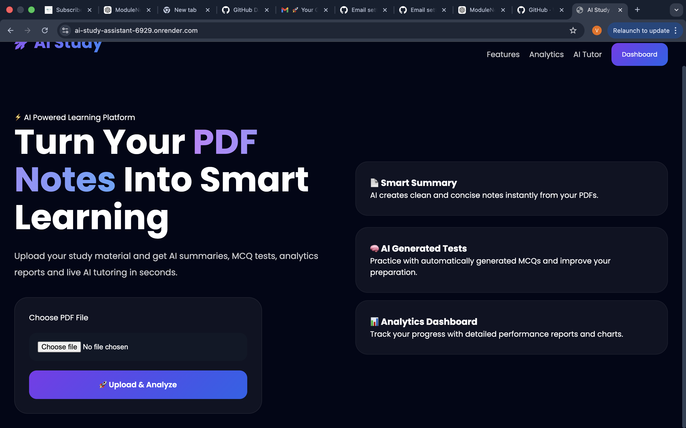
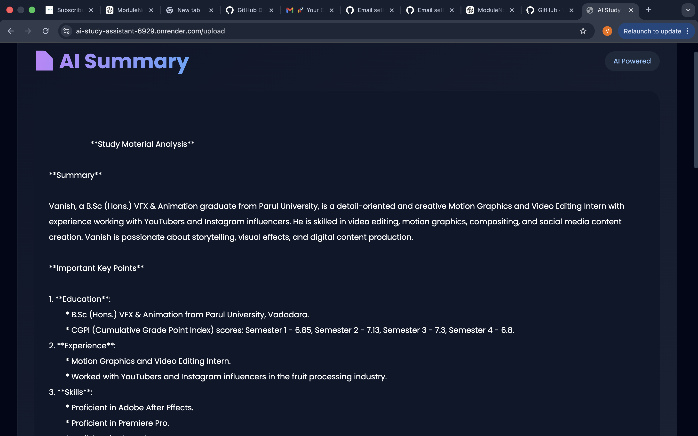
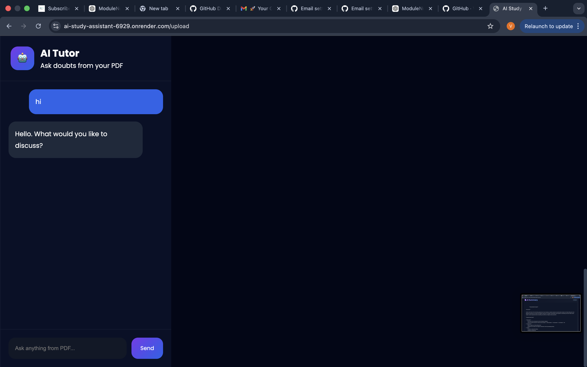
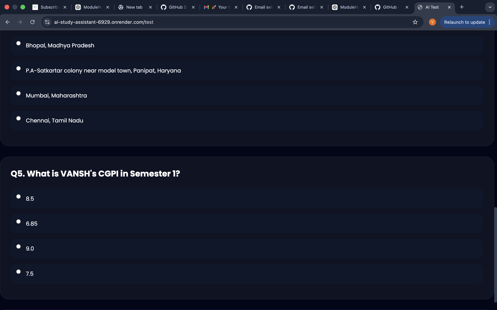
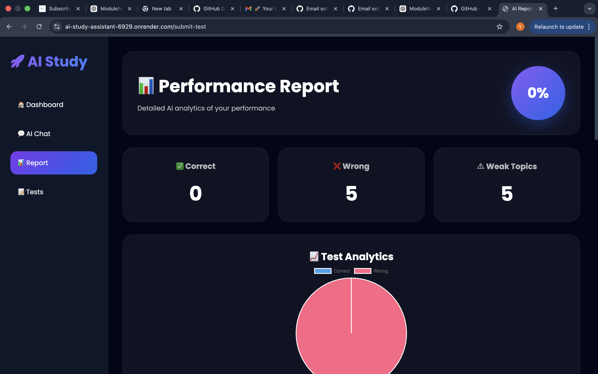

# AI Notes Summarizer 🚀

AI Notes Summarizer is a smart study assistant designed to help students learn faster and revise efficiently using AI.  
The platform can summarize long notes, generate viva questions, create MCQs, and provide AI-based study reports from uploaded PDF notes.

---

## Features

- Upload PDF Notes
- AI Notes Summarization
- Viva Question Generation
- MCQ Generation
- AI Study Reports
- AI Chatbot Assistant
- Fast & Clean UI
- Responsive Design

---

## Tech Stack

### Frontend
- HTML
- CSS
- JavaScript

### Backend
- Flask
- Python

### AI
- Groq API

### Database
- SQLite

### Deployment
- Render

---

# Screenshots

## Home Page

<p align="center">
  
</p>

---

## AI Summary

<p align="center">
  
</p>

---

## AI Chatbot

<p align="center">
  
</p>

---

## AI MCQ Generation

<p align="center">
  
</p>

---

## AI Reports

<p align="center">
  
</p>

---

## Live Demo

[Live Project](YOUR_RENDER_LINK)

---

## Installation

Clone the repository:

```bash
git clone YOUR_GITHUB_LINK
```

Move to the project folder:

```bash
cd AI-Notes-Summarizer
```

Install dependencies:

```bash
pip install -r requirements.txt
```

Run the application:

```bash
python app.py
```

---

## Future Improvements

- Voice Assistant
- Multi-language Support
- User Authentication
- Dark Mode
- Better AI Analytics

---

## Author

Vinay Yadav

```
